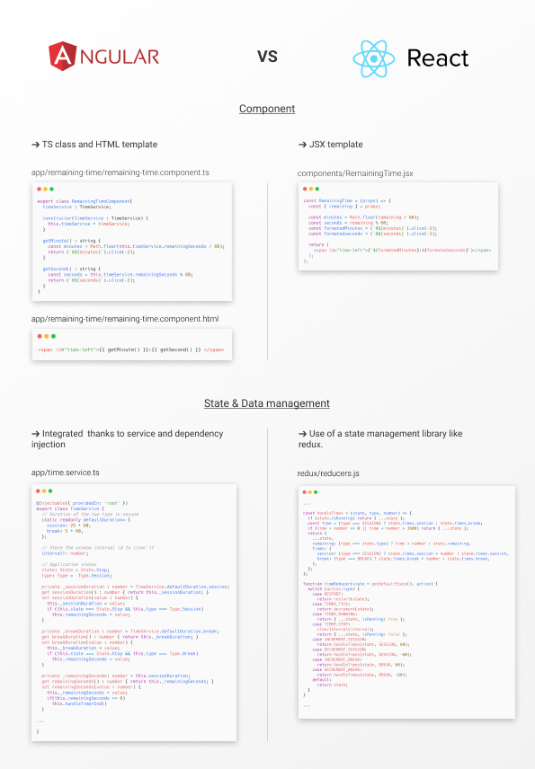
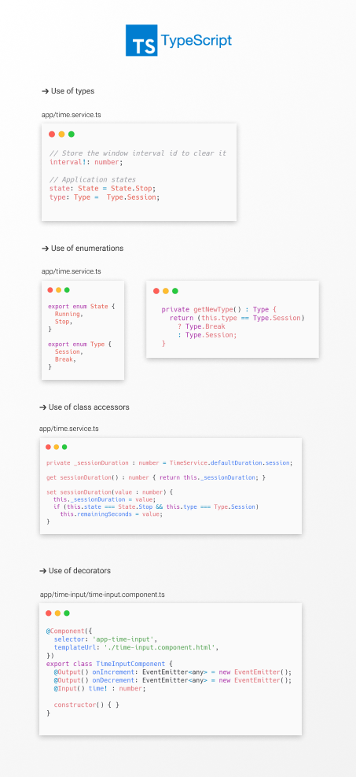

# Learning Angular and Typescript
An app cloning project in order to learn Angular and Typescript. [Orginal project](https://github.com/nathangobinet/podomoroclock) was developed using React and Redux. 
This project was carried out as part of a interview exercise. The result can be seen [here](https://nathangobinet.github.io/learning-angular-and-ts).

## Angular VS React overview

## Typescript overview

## Used learning ressources
- [Angular getting started](https://angular.io/start) 
- [Stackoverflow](https://stackoverflow.com/)

## Conclusion / Personal opinion

Both Angular and React allow to create a complete web interface. However, Angular seems to be more integrated and relies less on external libraries. The native integration of TypeScript with Angular allows better maintainability and facilitates large projects. However, this can slow down the speed of development.

